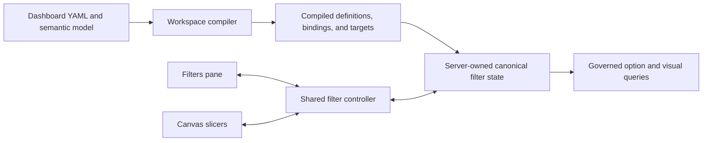

# Filter and slicer target architecture

LeapView models filtering as governed semantic state. A filter definition describes which predicates are legal, a binding gives that definition scope and targets, and one or more presentations let a reader inspect or change the same bound state. The right-side Filters pane and on-page slicers therefore share behavior without becoming the same layout object.

This design follows the useful part of the Power BI mental model: filters are scoped state, the Filters pane is a centralized editor, and slicers make selected filters prominent on the report canvas. LeapView intentionally uses a smaller, typed, deterministic contract instead of reproducing every Power BI filter category or authoring exception.

## Status and scope

This architecture is the current filter contract. Dashboard configuration, compiled serving state, commands, option requests, and browser signals use the typed definitions and bindings described here. Older compiled artifacts are rejected and must be redeployed. Saved reader views remain a follow-up built on the versioned applied-state contract.

The target covers:

- Semantic filter definitions and typed predicates.
- Report- and page-scoped bindings with optional component target sets.
- Filters pane and slicer presentations.
- Canonical applied state, optional shared draft state, defaults, clear, reset, and apply.
- URL state and future saved reader views.
- Static and governed dynamic option sources.
- Target resolution, cascading options, query execution, cancellation, and stale-result protection.
- Generated server/browser contracts, accessibility, authorization, observability, and testing.

Cross-filtering and cross-highlighting from chart, map, or table selections remain interaction features. They can compose with filter bindings, but they do not become filter definitions or slicers.

## Goals

- Give the Filters pane and canvas slicers one semantic state model and one mutation protocol.
- Separate predicate meaning, scope, targeting, state, and presentation.
- Make pane-only, slicer-only, hidden, locked, and multiply presented filters explicit.
- Preserve field types from the semantic model through URLs, commands, queries, options, and browser controls.
- Compile all implicit applicability into deterministic target sets.
- Keep option loading bounded and usable for both low- and high-cardinality fields.
- Make rapid changes cancel or supersede obsolete work.
- Allow page scope first without preventing report scope, synchronized presentations, or deferred apply.
- Ensure every visible state can be explained, cleared when allowed, and reset to its authored default.

## Non-goals

- Do not clone every Power BI automatic, include/exclude, drill, drillthrough, pass-through, or transient filter category.
- Do not automatically expose every field used by a visual as an editable filter card.
- Do not make renderer configuration, DOM selectors, or component-private events part of filter semantics.
- Do not treat hidden filters as a security mechanism.
- Do not let slicers construct unrestricted semantic queries.
- Do not use canvas placement to determine whether a filter applies.
- Do not maintain independent filter implementations or state envelopes for the pane and canvas.
- Do not make cross-highlighting a filter operation.

## Terminology

| Term | Meaning |
| --- | --- |
| Filter definition | Reusable semantic predicate policy: field, value type, legal predicate shapes, and option source. |
| Filter binding | An instance of a definition with report or page scope, compiled targets, defaults, URL identity, edit policy, and canonical state identity. |
| Filter state | Typed applied values for a binding plus optional pending draft values and revision metadata. |
| Filter presentation | A reader-facing editor bound to filter state, either a pane card or a canvas slicer. |
| Slicer | An on-page presentation of a filter binding. It is a page component, not a separate predicate system. |
| Filters pane | A centralized presentation of report bindings, active-page bindings, and explicitly component-targeted page bindings exposed to the reader. |
| Option domain | The authorized, context-sensitive values available to a categorical control. |
| Clear | Replace one binding with its unfiltered identity, when the binding is editable. |
| Reset | Restore authored defaults for the requested binding, page, or dashboard scope. |
| Apply | Atomically promote shared draft state to applied state. |

## Architectural invariants

1. A filter definition has semantic meaning but no page layout.
2. A binding establishes applicability independently of whether any presentation is visible.
3. A slicer and pane card bound to the same binding always show the same applied and pending state.
4. Presentation components emit typed mutations; they never replace the complete dashboard filter envelope.
5. The route-level filter controller is the only browser owner that projects optimistic filter mutations; server state remains canonical.
6. The server validates every binding, value, operator, target, revision, and option request.
7. The workspace compiler resolves semantic field types and produces exact compatible target sets.
8. Explicitly targeted incompatible components fail compilation; implicit scope excludes incompatible components deterministically.
9. Applied filter state, interaction selections, and spatial selections are independent roots and cannot erase one another.
10. Clear, reset, cancel, and apply have distinct operations and testable semantics.
11. URL state represents applied state only and is normalized by the server-owned contract.
12. Option queries and visual queries enforce the same authorization and data policies.
13. Every asynchronous result is bound to serving state, filter revision, and request generation.
14. Generated TypeSpec models are the wire authority for Go and TypeScript.
15. “All” means the unfiltered identity; it never means selecting only the currently loaded option page.

## Architecture overview



Deployment compilation produces immutable filter definitions, bindings, target sets, and presentation specifications. Runtime state contains only values and revisions. Browser components do not rediscover scope, infer field types, or decide which queries a filter affects.

## Authored and compiled contracts

### Filter definitions

A definition owns reusable semantic policy:

- Stable definition ID and reader-facing label/description.
- Semantic field and optional fact identity.
- Compiler-resolved value type.
- Allowed predicate variants and operators.
- Static or governed dynamic option source.
- Optional formatting metadata shared across presentations.

Predicate and presentation are separate axes. A categorical set predicate can appear as a dropdown, list, or button group. A range predicate can appear as numeric inputs, a slider, or a date picker. An input presentation can produce an equality, comparison, or string-match predicate only when the definition allows it.

The compiled predicate union is closed and typed:

```text
FilterExpression
  Unfiltered
  NullCheck
    operator: is_null | is_not_null
  Set
    operator: in | not_in
    values: FilterValue[]
  Comparison
    operator: equals | not_equals | contains | not_contains |
              starts_with | ends_with | greater_than |
              greater_than_or_equal | less_than | less_than_or_equal
    value: FilterValue
  Range
    lower?: {value: FilterValue, inclusive: boolean}
    upper?: {value: FilterValue, inclusive: boolean}
  RelativePeriod
    direction: previous | current | next
    count: positive integer
    unit: minute | hour | day | week | month | quarter | year
    includeCurrent: boolean
    anchor: current_time | first_available | last_available | fixed
    anchorValue?: FilterValue
```

The compiler restricts variants and operators by semantic type. For example, `contains` is valid for strings but not dates, and a relative period requires a date or timestamp.

`FilterValue` is a discriminated scalar rather than an arbitrary JSON value. Strings and booleans remain native; integers and decimals use canonical precision-safe representations; dates and timestamps use canonical ISO representations with compiled calendar and timezone semantics. `NullCheck` represents null filtering instead of overloading an empty string.

The server canonicalizes equivalent expressions before revisioning, URL serialization, caching, or query planning. An empty `Set`, a `Range` without bounds, and an omitted control normalize to `Unfiltered`; set values are typed, deduplicated, and deterministically ordered. A relative period preserves its relative rule for sharing and future report loads, but the server resolves it once per accepted filter revision to an absolute `Range`. Every option and visual query for that revision uses the same resolved range, evaluation instant, compiled timezone, and calendar. `fixed` requires a compatible `anchorValue`; data-relative anchors resolve against the same serving-state snapshot and incoming option-dependency context, excluding the binding itself.

### Filter bindings

A binding owns state identity and applicability:

- Stable binding ID.
- Referenced definition ID.
- Scope: report or page.
- Included or excluded component targets.
- Authored default expression.
- Stable URL parameter identity and encoding policy.
- State constraints such as single or multiple set selection and a maximum selected-value count.
- Reader editability and lock policy shared by every presentation.
- Pane visibility, order, and optional reader-facing label override.
- Optional binding-to-binding option interaction overrides.

Targets on a page binding use page-local component IDs. Targets on a report binding use qualified `pageID/componentID` identities. The compiler resolves both forms to canonical qualified runtime consumers and records an exact target set. An omitted target list means all semantically compatible consumers within scope, not every consumer unconditionally. A binding targeting one component is the LeapView equivalent of a visual-level filter; it does not introduce a third state scope.

Authored page-binding IDs are local to their page; report-binding IDs are local to the dashboard. The compiler issues every binding an opaque, stable `bindingKey` containing its resolved scope identity. Generated contracts and runtime state use that key rather than concatenating or parsing author-facing IDs. Presentations and authored option-interaction overrides use typed binding references that the compiler resolves to keys. This allows several pages to use a local binding ID such as `state` without colliding in report-wide state.

A report binding can be presented by slicers on several pages without duplicating state. Each presentation keeps its own placement and visual formatting. Hiding a slicer on one page does not remove the binding or its effect.

### Presentations

Pane cards and slicers reference a binding. They may configure presentation-only behavior:

- Style: dropdown, list, buttons, input, numeric range, date range, or relative period.
- Search, visibility of a semantically valid select-all action, option counts, and summary display.
- Compact or expanded layout.
- Title, description, and accessibility text.
- Responsive arrangement and page placement for slicers.

Presentation configuration cannot broaden allowed operators, change selection cardinality, change reader editability, change the semantic field, override security, or alter compiled targets.

The following is accepted dashboard configuration syntax:

```yaml
filters:
  state:
    label: State
    field: customer_state
    predicates:
      - kind: set
        operators: [in, not_in]
    options: {kind: distinct, limit: 50}

filter_application: {mode: immediate}

pages:
  - id: overview
    filter_bindings:
      state:
        filter: state
        targets: {include: [revenue, orders]}
        default: {kind: unfiltered}
        selection: {mode: multiple, max_selected_values: 50}
        reader_editable: true
        url: {param: state, encoding: typed_v1}
        pane: {visible: true, order: 10}
    components:
      - id: state-slicer
        kind: slicer
        binding: {scope: page, id: state}
        presentation:
          style: dropdown
          search: true
        placement: {col: 1, row: 1, col_span: 3, row_span: 2}
```

The binding exists even if `state-slicer` is absent. Conversely, the pane can hide `state` while its slicer remains visible.

## Canonical state

Server-owned filter state is keyed by compiled `bindingKey` rather than author-facing binding or presentation ID:

```text
DashboardFilterState
  revision
  appliedControls: bindingKey -> AppliedFilterState
  draftControls?: bindingKey -> FilterExpression
  dirtyBindings: bindingKey[]
  defaultsRevision

AppliedFilterState
  expression: FilterExpression
  resolvedExpression: Unfiltered | NullCheck | Set | Comparison | Range
  evaluatedAt?: timestamp
```

`expression` preserves shareable reader intent. `resolvedExpression` is the exact predicate used for governed queries in this revision; it differs when a relative period is resolved to absolute bounds. Interaction selections and spatial selections remain sibling state, not optional fields copied by each filter control.

### Immediate and deferred application

One dashboard-level filter policy selects immediate or deferred application for every binding and presentation in that dashboard. Binding- or presentation-specific application modes are not supported because they would make shared state and Apply transaction boundaries ambiguous.

Immediate mode validates and applies each completed mutation. Text input is debounced; range and date editors apply only a complete value unless the shared control has an explicit Apply action.

Deferred mode writes shared server-owned draft state for the active route. Every pane card and slicer bound to the same binding displays the draft and pending indicator. Apply promotes all dirty report and active-page bindings reachable from that route in one state transition, resolves relative expressions once, and advances the filter revision once. Cancel discards those drafts without issuing visual queries. Navigating with dirty drafts requires Apply, Discard, or an explicit product policy that selects one of those outcomes; drafts never silently become applied state.

### Clear and reset

Clear replaces an editable binding with `Unfiltered`. Reset restores the authored default:

- Reset binding restores one binding.
- Reset page restores bindings scoped to the active page; report bindings remain unchanged.
- Reset dashboard restores report bindings and every persisted page-binding state to authored defaults.

Reset does not alter presentation ephemera such as open popovers, search text, focus, or responsive layout. Locked bindings cannot be cleared or edited by readers but may be restored by an authorized authoring or administrative operation. Hidden bindings are not shown, but their applied state remains explainable through authorized diagnostics.

### URL and saved state

Initial URL parameters are parsed, typed, authorized, and normalized by the server. The server returns canonical applied state and canonical URL parameters. Browser history uses that returned representation rather than maintaining a second predicate parser.

Only applied state is shareable. Draft state, open popovers, search text, option pages, focus, and responsive layout are ephemeral.

Unknown parameters do not create filters. Invalid values produce a bounded validation result and cannot reach query planning. Stable URL parameter names are compatibility-sensitive. Future saved reader views store the same versioned applied-state contract plus dashboard and serving-definition identity.

## Browser architecture

The browser uses shared leaf controls and separate surface shells:

- Typed categorical, input, range, date, and relative-period controls own accessible input behavior.
- A pane-card shell owns grouping, scope labels, lock/visibility affordances, clear/reset actions, and expanded layout.
- A slicer shell owns page placement, compact/expanded canvas presentation, title, and responsive behavior.
- The route-level controller owns optimistic projection, draft coordination, URL updates, command serialization, and reconciliation with canonical server patches.

A leaf control emits a mutation such as:

```text
FilterMutation
  bindingKey
  baseRevision
  clientMutationID
  operation
  expression?
```

It does not emit the whole dashboard filter-state object. The controller projects the mutation onto one optimistic typed state root while preserving unrelated bindings, then sends the typed command. Interaction and spatial selections remain independent roots. Only the server advances canonical state and revisions. Rejected or superseded optimistic state reconciles to the returned canonical patch.

Every validation result echoes the command's `clientMutationID`. This lets the controller reconcile a rejected optimistic edit even when the canonical filter revision and state are unchanged.

The TypeSpec signal contract generates the filter definition, binding, presentation, state, option page, mutation, validation, and status models used by Go and TypeScript. Handwritten structural duplicates are forbidden by tests.

## Compilation and validation

The workspace compiler:

1. Resolves each definition field against the semantic model.
2. Derives value type, nullability, formatting, timezone, and calendar semantics.
3. Validates predicate variants, operators, relative anchors, and static options.
4. Resolves each binding scope, authored default, URL identity, state constraints, edit policy, and canonical binding key.
5. Resolves page-local or report-qualified component targets into canonical qualified runtime consumers.
6. Computes the binding-to-binding option dependency graph and validates explicit overrides.
7. Validates presentation style against predicate, value type, and binding state constraints.
8. Checks binding, presentation, and route-visible URL parameter identities for collisions.
9. Validates locked/hidden/default combinations and the dashboard application policy.
10. Produces deterministic compiled definitions, bindings, target sets, option dependencies, and revisions.

The same normalized resource graph produces byte-equivalent compiled filter content and the same revision digest.

## Runtime query behavior

### Applying filters

The server accepts a typed mutation with dashboard, page, binding key, client mutation ID, and base revision. It authorizes the route, verifies that the binding is editable, validates the expression, deduplicates retries, rejects stale or incompatible state, and computes the next canonical revision.

Each affected visual query receives the conjunction of applicable report and page bindings plus targeted interaction selections and spatial selections. Within a set expression, values are disjunctive. The query planner preserves predicate grouping explicitly rather than relying on SQL precedence.

A binding does not apply to its slicer as a visual target. Its state influences the slicer's option domain through the separate option-query rules.

Every visual, table window, and option result carries the serving-state identity and filter revision it satisfies. When canonical state advances, affected targets enter an updating state immediately. They may retain their previous result for visual continuity only with an explicit stale/updating indicator, and interactions from that older result are disabled or rejected by revision validation. A target becomes settled only after it displays a result or terminal error for the current filter revision. Streaming completion may be partial, but the UI never presents mismatched data as current.

### Option domains

Static options are compiled into serving state. Dynamic options use a governed endpoint or command with:

- Binding key.
- Search text.
- Opaque page cursor and bounded limit.
- Applied filter revision.
- Serving-state identity.

The compiler produces a directed option dependency graph between bindings. By default, an edge `source -> target` exists only when:

- Both bindings can be active on the same page.
- The source predicate is semantically applicable to the target option query.
- Their compiled non-control consumer target sets overlap.
- The author has not explicitly disabled the option interaction.

Authors can explicitly include or exclude typed binding references when the derived behavior is not the intended report experience. The compiler resolves them to binding keys, validates every override, and records the resulting graph in serving state. Cycles are allowed because each option query evaluates one stable applied-state revision; option results never feed back into canonical filter state.

An option query applies the incoming edges for the binding being populated and excludes the binding itself. This lets related slicers constrain one another without causing a selected value to disappear solely because it filters itself, while a narrowly targeted filter cannot unexpectedly constrain an unrelated slicer. Selected values remain selected and are returned even when they fall outside the current page or search result. Availability metadata explains when another binding excludes them; the runtime never silently removes an applied value.

Option results contain typed values, display labels, optional counts, completeness, and continuation state. Client search never pretends that a bounded first page is the complete domain. High-cardinality fields require server search or a more appropriate input control.

Data policies and principal authorization apply before distinct values or counts are returned. Option caches are partitioned by serving state, principal/data-policy identity, binding, normalized context excluding self, search, and page cursor.

### Concurrency and supersession

Every mutation advances or proposes a filter revision. The route controller serializes state-changing commands per dashboard stream. Later local mutations queue behind an in-flight mutation and rebase on the returned canonical revision; each command carries a stable client mutation ID so retries cannot duplicate a transition. Query work is keyed by dashboard page, serving state, filter revision, target, and window state. A newer revision cancels or supersedes older option and visual work. Late results cannot patch a newer revision.

Deferred apply coalesces several edits into one revision. Immediate mode may debounce text input and coalesce target queries, but it cannot reorder accepted state. Status signals distinguish pending validation, pending apply, querying, partial completion, error, and settled state.

## Scope and synchronization

Page scope is the first implementation target:

- Page bindings survive regardless of pane or slicer presence.
- Their URL state belongs to that page route.
- Their targets are components on that page.

Report bindings extend the same model:

- State persists across report page navigation.
- A report binding affects compatible components on all included pages.
- Any page may show zero or more presentations of that binding.

A component-targeted filter is a page binding with an explicit component target set. A report binding can also name qualified targets such as `overview/revenue`. Targeted filtering does not depend on whichever visual currently has browser focus.

Synchronization is state identity, not event forwarding. Presentations that should remain synchronized reference the same binding. Separate bindings do not become synchronized merely because they use the same semantic field.

## Accessibility and explanation

Every presentation exposes:

- Programmatic label, description, current summary, scope, and pending/applied state.
- Keyboard operation appropriate to its control pattern.
- Visible focus and non-color selected, disabled, unavailable, and pending indicators.
- A clear action when editable and nonempty.
- Validation and query errors associated with the control.

The product can explain which bindings and interaction selections affect a visual because the compiler owns target sets and runtime state owns applied expressions. Explanations use reader-facing labels and summaries without exposing concealed policy details.

Canvas source order remains keyboard order. Responsive slicers can change layout but not semantic order or control identity.

## Security and privacy

Filters narrow authorized data; they never grant access. Workspace authorization and data policies are evaluated independently of reader filter state.

- Hidden bindings are presentation policy, not row-level security.
- Option queries cannot reveal values or counts excluded by data policy.
- URL parameters cannot reference undeclared fields, operators, targets, or bindings.
- Locked filters are enforced on the server.
- Audit records identify normalized binding IDs and operators while applying existing safe-value redaction rules.
- Public and embedded dashboards use the same compiled binding rules with surface-specific visibility and persistence policy.

## Observability

Filter operations record:

- Dashboard, page, binding, operation, and application mode.
- Base and resulting filter revision.
- Affected target count.
- Option versus visual query counts.
- Current, updating, stale, and terminal-error target counts by filter revision.
- Cache/coalescing outcome, queue time, execution time, cancellation, and supersession.
- Validation or authorization failure category without unsafe values.

This allows operators to distinguish slow option domains, excessive immediate-mode refreshes, expensive target fan-out, and stale-result suppression.

## Power BI prior art and deliberate differences

Power BI provides useful prior art for separating canvas slicers from the centralized Filters pane, supporting visual/page/report scope, synchronizing slicers across pages, configuring visual interactions, and deferring application for query reduction.

LeapView deliberately differs:

- One typed predicate and binding model replaces many origin-specific filter categories.
- Pane cards and slicers use the same controls and application policy.
- Explicit configuration and compilation replace editing-mode drag-and-drop behavior.
- Scope is never inferred from canvas placement.
- Synchronization shares binding state rather than forwarding changes between independent slicers.
- Cross-filter and cross-highlight selections remain interaction state.
- Generated contracts reject invalid combinations instead of tolerating optional property bags.

See the official Power BI documentation for [slicers](https://learn.microsoft.com/power-bi/visuals/power-bi-visualization-slicers), [filter scopes](https://learn.microsoft.com/power-bi/create-reports/power-bi-report-add-filter), and [filter-pane behavior](https://learn.microsoft.com/power-bi/create-reports/power-bi-report-filter).

## Implemented delivery

The contract is delivered as one public cutover backed by staged internal layers:

- The compiler owns typed definitions, report/page bindings, opaque keys, exact consumer targets, presentation compatibility, time semantics, and option dependencies.
- Dashboard-view sessions own canonical applied/draft filter state independently from interaction and spatial selections, with compare-and-swap persistence and bounded mutation idempotency.
- Commands mutate one binding or apply, cancel, or reset a scope; every command reconciles against a base revision.
- Option pages are lazy, governed, dependency-aware, paginated, cache-partitioned, and protected against stale requests.
- Pane cards and slicers wrap the same generated-type leaf controls and share one route-level controller.
- YAML, generated schemas, examples, browser contracts, and compiled artifact versions changed atomically.

Saved reader views are intentionally excluded. They will persist the existing versioned applied-state representation rather than introduce another filter model.

## Required tests

Contract and compiler tests must prove:

- Pane-only and slicer-only bindings compile and apply.
- Multiple presentations of one binding cannot diverge.
- Defaults, URL serialization, selection cardinality, and editability remain binding-specific when definitions are reused.
- Invalid predicate/type/presentation combinations fail.
- Binding or presentation attempts to override the dashboard application policy fail.
- Explicit incompatible targets fail and implicit targets compile deterministically.
- Page-local binding IDs, report binding IDs, and page-local/report-qualified target identities compile to noncolliding canonical keys.
- URL parsing and serialization round-trip typed applied state.
- Clear differs from reset when the authored default is filtered.

Runtime tests must prove:

- Filter mutation preserves interaction and spatial selections.
- Target queries receive exactly the applicable binding expressions.
- Relative expressions resolve once per revision and every consumer uses identical absolute bounds.
- Option queries follow the compiled dependency graph, exclude self, retain unavailable selected values, enforce policies, and paginate.
- Deferred Apply advances one revision and executes each affected consumer once.
- Mutation retries are idempotent, and queued mutations rebase on canonical revisions without losing edits.
- Cancelled, stale, or superseded visual and option results cannot replace newer state.

Browser tests must prove:

- Pane and slicer controls render and mutate the same state.
- Keyboard, focus, labels, summaries, errors, locked state, and pending state are accessible.
- Responsive presentation does not change state identity or keyboard order.
- Browser history reflects canonical applied state, never drafts.
- A target displaying an older filter revision is visibly updating and cannot emit accepted interactions.
- Disconnecting a presentation disposes observers without deleting bound state.

These tests are architectural gates, not optional component coverage. A new filter or slicer variant is complete only when compiler, runtime, generated contract, pane, canvas, URL, authorization, and supersession behavior agree.
