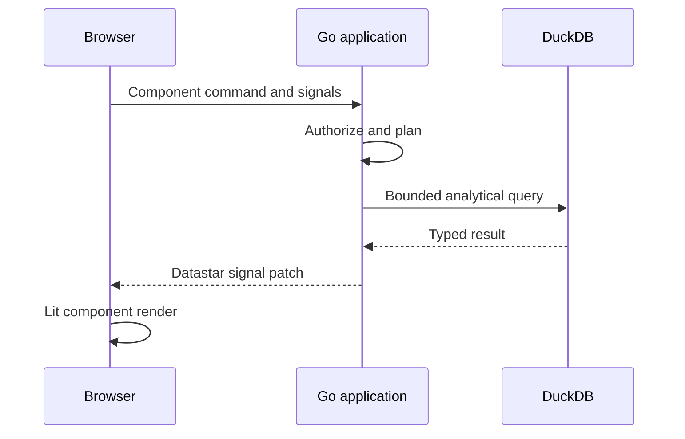

# Runtime architecture

Runtime behavior begins with active deployment resolution and ends with a bounded response, signal patch, or background lifecycle transition. Mutable source files are authoring inputs; active artifacts and serving pointers are runtime inputs.

## Process assembly

`cmd/leapview/main.go` loads process-global configuration, opens platform and analytical storage, constructs repositories and domain services, registers routes, and starts the HTTP server. Production configuration validation occurs before unsafe modes are permitted.

The application router composes liveness/readiness, protected metrics, authentication, workspaces, dashboards, deployments, managed data, access, audit, administration, agent, and headless API routes. Middleware establishes trusted request context such as principal, rate limits, and security headers before handlers reach domain operations.

## Active project resolution

A request resolves workspace identity while the server supplies its permanently bound instance environment. Serving-state repositories find the active deployment/artifact and associated analytical snapshot. Runtime packages construct workspace catalogs, dashboards, semantic models, and query services from validated active metadata.

The request resolves active state once for its operation. A deployment or refresh activated during the request does not change the snapshot already leased by that request.

## Authorization

Handlers authorize the principal on known securable objects. Effective privilege can combine role binding, explicit grant, ownership, parent inheritance, token restriction, and data policy. Authorization does not create missing securable objects as a side effect of a query.

Data policies are applied before governed analytical work. Browser, API, CLI, and agent queries must share this boundary.

## Dashboard queries

Dashboard report contracts validate filters, URL parameters, visual shapes, table cardinality, selection mappings, targets, and component references. Runtime services normalize canonical state and build consumer requests for KPI, chart, table, and filter-option results.

The consumer optimizer can coordinate related page work. The stream coordinator tracks generations, cancellations, and result delivery so a late result from superseded state cannot overwrite the latest interaction.

## Semantic queries

Headless semantic requests identify model, dataset, dimensions, measures, filters, sorting, and bounds. The semantic query planner validates fields and relationships, chooses fact/join paths, and produces a plan for DuckDB. Explain operations return resolution information without turning generated SQL into a new public input surface.

Query audit records operation, principal, workspace, model/target, status, timing, and safe diagnostics according to the surface contract.

## Read execution

Interactive reads enter a bounded executor with configured maximum running and queued work plus queue and execution timeouts. Request cancellation should release queued or running work. A query runtime lease protects the resolved DuckLake snapshot until execution completes.

The result is normalized into API or UI-owned types rather than exposing driver rows directly. Limits, scalar types, empty behavior, and formatting metadata are preserved through that conversion.

## Refresh execution

Refresh commands create explicit jobs and generations. The write executor limits simultaneous materialization. Workspace refresh planning orders dependent model tables and writes isolated replacement state.

After successful materialization and validation, DuckLake commits a snapshot and LeapView flips the active serving pointer. Older state drains until no active reference or query lease protects it. Failed and superseded jobs do not activate.

## UI delivery

Gomponents renders initial HTML and typed bootstrap signals. Datastar handlers receive component commands and return focused signal patches. Long-lived streams are used only where later publisher events are expected; one-shot commands complete after their bounded patches.

Lit components read signal paths through the shared bridge. Components may show optimistic selection feedback, but canonical state from the server reconciles it.

## Background and maintenance work

Deployment candidates, managed uploads, refresh jobs, agent runs, backup/restore, retention maintenance, and analytical cleanup each have explicit lifecycle state. Background work must be restart-aware, bounded, attributable, and unable to overwrite a newer generation.

Package direction should remain: transport calls application/domain services; services enforce authorization and lifecycle; repositories and adapters implement persistence/external systems. Tests should fail when a new shortcut violates that direction.
