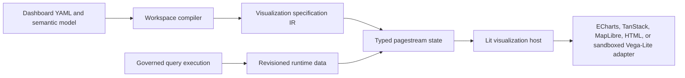
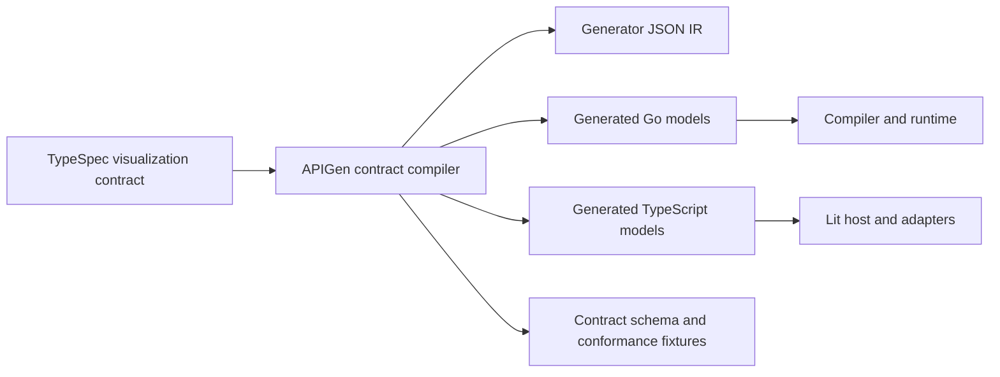

# Visualization architecture

This document defines the architecture for LeapView visualizations. A versioned, renderer-independent visualization intermediate representation (IR) connects compiled authoring intent to every runtime and browser surface. ECharts remains the built-in BI chart engine, TanStack owns tabular interaction, MapLibre owns geographic rendering, and a sandboxed Vega-Lite surface supports custom declarative visuals.

The architecture optimizes for semantic correctness, deterministic behavior, strong contracts, scalability, accessibility, security, and renderer replaceability. Implementation cost is not a design constraint.

## Status and scope

This is the normative production contract. LeapView gives charts, KPIs, tables, matrices, and pivots one compiled definition namespace, page-component kind, signal root, interaction source kind, window command, and headless API surface. The standalone TypeSpec contract generates Go, TypeScript, and strict JSON Schema models. Signals, APIs, agent artifacts, documentation examples, and the visualization host exchange the same versioned envelope and reject legacy payloads.

The visualization IR covers:

- Cartesian, part-to-whole, distribution, matrix, hierarchy, graph, geographic, financial, single-value, table, and pivot visuals.
- Immutable visual intent and field semantics.
- Inline and windowed runtime datasets, freshness, completeness, cardinality, and source-row identity.
- Formatting, scales, legends, labels, annotations, comparisons, and interactions.
- The contract between Go and browser renderers.

One visual surface does not imply one data shape or browser component. The IR uses discriminated specifications and data states so charts can receive bounded inline frames while tables, matrices, and pivots retain sorting, virtualization, pivot state, exact or estimated cardinality, and bounded row-window behavior.

## Goals

- Preserve semantic meaning from the compiled model through the browser renderer.
- Make temporal, quantitative, categorical, geographic, and nullable data explicit instead of inferred from values.
- Generate compatible Go and TypeScript contracts from TypeSpec.
- Keep one stable visual identity across configuration, pages, signals, commands, status, APIs, agents, and renderers.
- Keep renderer libraries behind LeapView-owned adapters.
- Allow one visualization specification to target more than one conforming renderer.
- Separate immutable specification state from frequently changing runtime data state.
- Reject invalid or stale state before it reaches a renderer.
- Keep formatting consistent across charts, KPIs, tables, exports, accessibility text, and headless output.
- Scale to many dashboard tiles and high-cardinality results without quadratic data shaping or unnecessary remounts.
- Make renderer failures isolated, observable, recoverable, and safe.
- Support accessible non-canvas representations and reduced motion as product behavior.

## Non-goals

- Do not make ECharts, Vega-Lite, MapLibre, or another library's option model a public dashboard contract.
- Do not expose arbitrary JavaScript callbacks or formatter functions in project configuration.
- Do not let renderers execute queries, resolve semantic fields, apply authorization, or invent aggregations.
- Do not make the browser infer field types, time grains, timezones, currency, null semantics, or selection identity.
- Do not silently sample, truncate, reorder, coerce, or discard query results in a renderer.
- Do not collapse inline charts and windowed tabular visuals into one permissive data structure.
- Do not force Markdown, filters, controls, or page layout components into the visualization IR.
- Do not make custom visualization specifications equivalent to trusted built-in IR.

## Architectural invariants

1. The workspace compiler owns visual meaning.
2. The governed query layer owns data production and bounds.
3. The visualization IR is independent of rendering libraries.
4. A renderer consumes valid IR; it does not repair or reinterpret invalid IR.
5. Every interactive renderer datum that can affect server state resolves to an original dataset row identity.
6. Immutable specification revisions and runtime data revisions are distinct.
7. Browser theme, container size, device pixel ratio, hover, and focus are presentation context, not persisted IR.
8. All externally authored custom specifications execute in a stricter trust boundary than built-in visuals.
9. Unknown versions, kinds, fields, renderers, geometry, and extension keys fail closed.
10. A chart library can be replaced without changing dashboard query semantics or interaction commands.
11. Every analytical page component uses `kind: visual`; its referenced specification discriminator selects the product presentation.
12. Point and row interactions use `sourceKind: visual`; interaction kind and specification determine the gesture semantics.
13. Inline and windowed data states share identity, schema, revision, and error rules without sharing an inappropriate transport shape.

## Architecture overview



The production pipeline has two data paths:

- Deployment compilation produces immutable visualization specifications and query bindings.
- Runtime execution produces bounded dataset frames compatible with those specifications.

Pagestream transports product state. It does not transport renderer-library configuration.

## Visualization contract

### Envelope

Each visual signal contains a versioned envelope:

```text
VisualizationEnvelope
  schemaVersion
  visualID
  rendererID
  specRevision
  spec
  dataRevision
  dataState
  selection
  status
```

`schemaVersion` identifies the wire contract. `rendererID` is the compiler-resolved presentation implementation; built-in authors select a visual type rather than a rendering library. `specRevision` is a digest of the compiled immutable specification. `dataRevision` is monotonic within a stream generation. Data state declares the specification revision it satisfies. The browser rejects data for another specification and ignores revisions older than the mounted revision.

The envelope may be patched at nested signal paths, but its logical state is complete and independently valid after every accepted patch.

### Specification

`VisualizationSpec` expresses product meaning:

- Visual kind and mark intent.
- Named dataset schemas.
- Field identity, label, semantic role, data type, nullability, format, unit, and optional time or geographic metadata.
- Channel encodings that reference fields by stable ID.
- Scale, axis, legend, label, stacking, ordering, comparison, and annotation intent.
- Interaction definitions and mappings.
- Explicit data budgets and completeness requirements.
- Accessibility title, description, and summary policy.

The specification is a discriminated union. Each kind has only meaningful fields. A geographic specification cannot accidentally contain a Cartesian axis; a single-value specification cannot accidentally declare a color series.

The closed kinds are:

- `cartesian` for line, area, bar, column, scatter, histogram, combo, waterfall, heatmap, candlestick, and boxplot marks;
- `proportional` for pie, donut, and funnel;
- `hierarchy` for treemap, sunburst, tree, graph, and Sankey;
- `polar` for radar and gauge;
- `geographic` for choropleth, point, heat, density, reference, and path layers;
- `kpi` for single-value summaries;
- `table` for windowed detail rows;
- `matrix` for row-and-column analytical comparison;
- `pivot` for grouped, expandable multidimensional summaries;
- `custom` for separately sandboxed declarative specifications.

### Dataset schemas

A specification contains one or more named dataset schemas. `primary` is required. Additional datasets support annotations, targets, comparisons, forecasts, or geographic joins without encoding unrelated values into synthetic rows.

Each field definition contains:

```text
Field
  id
  sourceRef
  role             dimension | measure | metadata | identity
  dataType         string | boolean | integer | decimal | temporal | date | geographic
  nullable
  label
  format
  timeMetadata
  geographicMetadata
```

`sourceRef` identifies compiled semantic origin where applicable. It is not an executable expression. Renderer channels reference `dataset` and `field` IDs, never array positions or user-facing labels.

Temporal metadata includes grain, timezone, calendar, week start, and whether the value denotes an instant or a bucket. Geographic metadata includes identifier system, geometry asset, join field, and unmatched-region policy.

### Runtime data states

Runtime data is a discriminated union rather than a bag of optional chart and table fields:

```text
VisualizationDataState
  InlineDataState
    datasets
  WindowedDataState
    schema
    cardinality
    availableRows
    rowCap
    chunkSize
    resetVersion
    sort
    blocks
```

Charts, KPIs, maps, and bounded summary visuals normally use `InlineDataState`. Tables, matrices, and pivots normally use `WindowedDataState`. A visual kind may support another state only through an explicit versioned contract; the browser never detects the state from the presence of optional properties.

An inline `VisualizationFrame` contains:

- Dataset ID.
- Specification revision.
- Data revision and refresh generation.
- Ordered column IDs matching the declared dataset schema.
- Rows containing JSON scalar values only.
- Completeness state: complete, truncated, partial, or empty.
- Optional continuation or aggregation metadata owned by LeapView.

Each window block contains start, ordered rows, request sequence, reset version, and sort identity. The host rejects late blocks from an older request, reset, sort, frame, or specification revision. Cardinality explicitly distinguishes unknown, lower-bound, estimated, and exact counts. Capping and truncation remain visible product state.

The frame builder preserves `null`; it never converts missing or invalid values to zero. It rejects non-finite numbers and incompatible values. It validates row width, column identity, type compatibility, bounds, ordering guarantees, required identity fields, and window metadata before publication.

Arrays-of-scalars are the canonical row wire format because the schema already owns names and types. They are more compact than repeated row objects and allow adapters to build indexes in one linear pass. Generated helper APIs provide safe field lookup so application code does not depend on raw column positions.

### Source-row identity

Selection state carries a `DatumRef` containing dataset ID, data revision, and compiled identity-field values. The host resolves renderer-private dataset and row locators against the currently mounted data state, then shared interaction code creates semantic command mappings. A row index is only a private lookup optimization; it is never durable identity. Windowed adapters additionally bind lookup to reset and block identity so an event from an evicted or superseded block cannot select a different row.

Generated nodes, totals, stack helpers, layout artifacts, cluster centroids, and synthetic annotations do not receive a `DatumRef` unless the compiler explicitly defines how they map to source rows. This prevents graph nodes, Sankey nodes, aggregated map clusters, or renderer helper series from inventing filter identity.

## Compilation

The workspace compiler creates the visualization specification during deployment, after it has resolved the dashboard resource against the semantic model.

Compilation performs:

1. Resource and renderer-neutral option validation.
2. Semantic field and measure resolution.
3. Query-shape validation.
4. Field role, type, nullability, format, unit, grain, timezone, and identity resolution.
5. Visual-kind and channel construction.
6. Scale, ordering, comparison, annotation, interaction, and data-budget validation.
7. Renderer selection from the visual discriminator and capability validation for the resolved renderer.
8. Canonical serialization and specification revision hashing.

The compiled specification is stored in the immutable serving-state artifact. Runtime handlers do not rebuild it from mutable YAML or repeat semantic inference.

Compiler output is deterministic: the same normalized resource graph produces byte-equivalent canonical specification content and the same revision digest.

## Runtime frame production

The dashboard runtime loads the compiled specification and its governed query binding. Query execution returns typed columns and rows. A frame builder converts the result into the declared inline or windowed data state.

The frame builder owns product-level transformations that are semantically declared by the specification, including deterministic bucketing, comparison alignment, hierarchy path construction, waterfall accumulation, or annotation joining. Renderer-only layout such as ECharts graph coordinates remains in the adapter.

Runtime never sends a frame that fails specification validation. When validation fails, the signal publishes a typed visual error and retains the last compatible complete frame when the refresh lifecycle permits stale display.

Renderers do not silently enforce cardinality. Query planning and frame production apply declared budgets and report whether the result is complete, capped, partial, or truncated. Sampling or downsampling must be explicit, deterministic, tested, and represented in frame metadata.

All data is published beneath the `visuals` signal root. Window requests identify a visual, not a separate table resource, and use the same authorization, filter, selection, status, audit, and cancellation boundaries as inline visual queries.

## TypeSpec and code generation

TypeSpec is the source of truth for the cross-language visualization contract. `api/visualization` defines the shared closed unions used by signals, APIs, Go, and TypeScript instead of hand-maintaining parallel models or accumulating optional fields on a permissive base type.



The contract lives under `api/visualization/` and is referenced by `api/signals`. APIGen shared-contract imports let signal generation reference the generated visualization package without duplicating models.

Generated outputs are:

- `internal/visualization/ir/models.gen.go` for canonical Go data models;
- `web/generated/visualization/index.ts` for canonical browser types;
- `api/gen/visualization-ir.json` for generator inspection;
- a JSON Schema or equivalent structural contract for fixtures and external tooling;
- cross-language conformance fixtures for representative and boundary values.

Hand-written code owns builders, semantic validation, canonicalization, formatting behavior, datum resolution, and renderer adaptation. Generated files contain data structures and serialization contracts only.

The existing `api/signals` target remains the authority for pagestream signal roots and commands. It imports or references the shared visualization models. Generated artifacts are never edited directly.

## Package ownership

Target server packages:

```text
internal/visualization/ir/          generated models, canonicalization, versions
internal/visualization/definition/  immutable compiled definition and query-result contracts
internal/workspace/compiler/        semantic model and dashboard -> immutable spec
internal/visualization/runtime/     query result -> validated inline or windowed state
internal/visualization/format/      format contract and Go implementation
internal/dashboard/command/         datum and spatial selection -> semantic commands
```

Target browser packages:

```text
web/generated/visualization/                    generated TypeScript contract
web/components/dashboard/visualization/host.ts       product lifecycle and actions
web/components/dashboard/visualization/format.ts     browser format implementation
web/components/dashboard/visualization/registry.ts   renderer capability registry
web/components/dashboard/visualization/adapters/     built-in renderer adapters
```

Dashboard runtime packages may depend on visualization compilation and frame interfaces. Visualization packages do not depend on HTTP, Datastar, Lit, ECharts, MapLibre, or Vega-Lite.

## Browser host

The Lit visualization host owns:

- Signal subscription and revision checks.
- Renderer selection and lazy loading.
- Unified visual-window command sequencing for windowed data states.
- Theme-token resolution.
- Container measurement and animation-frame-coalesced resize.
- Loading, empty, partial, stale, and error presentation.
- Accessible title, description, summary, and data fallback.
- Focus, show data, copy, raw/formatted export, and clear-selection actions.
- Mapping renderer datum events to typed LeapView interactions.
- Renderer lifecycle, failure isolation, and disposal.

The host never constructs renderer-specific series, table definitions, or option objects. Page components always reference a visual ID; the specification discriminator selects the adapter while status, actions, selection, focus, and layout remain shared.

The host lazy-loads renderer code through the registry. Query execution and state ownership remain independent of renderer mounting, while screenshot and export modes can request eager deterministic rendering.

## Renderer registry and lifecycle

Each renderer registration declares:

- Stable renderer ID and implementation version.
- Supported IR schema versions and visualization kinds.
- Required browser capabilities.
- Whether it supports interactive selection, snapshot export, and server/headless parity.
- An asynchronous loader and factory.

The registry rejects unsupported kind/renderer combinations before loading implementation code.

A renderer handle implements a small product-owned lifecycle:

```text
mount(container, context) -> handle
handle.update(snapshot, changes)
handle.resize(size, devicePixelRatio)
handle.snapshot(request)
handle.dispose()
```

`snapshot` contains immutable specification, current data state, selection, theme tokens, locale, and reduced-motion preference. `changes` identifies specification, data, selection, theme, locale, or size changes so adapters can update incrementally without comparing serialized payloads.

The host guarantees ordered lifecycle calls and one live handle per visual. A renderer must not keep global listeners, observers, timers, workers, map instances, or library objects after disposal.

## Built-in renderer strategy

### ECharts

ECharts remains the default for trusted built-in non-geographic BI visuals. The adapter translates typed IR into `dataset`, `encode`, axes, series, legends, tooltips, visual maps, and interaction metadata.

The adapter:

- Builds field indexes in linear time.
- Uses stable series IDs and explicit replacement scopes.
- Preserves zoom, legend, brush, and selection state across compatible data updates.
- Coalesces resize and avoids unconditional remounts or full option replacement.
- Uses canvas consistently so compatible updates never remount merely because cardinality changed.
- Disables dashboard animation and honors reduced motion.
- Loads rare chart modules in separate chunks where that materially reduces initial dashboard code.

### TanStack and HTML

TanStack is the interaction engine for table, matrix, and pivot specifications. The adapter consumes typed column schemas and windowed data state, manages virtualization and ephemeral column layout, requests blocks through the shared visual-window command, and rejects stale block delivery by revision, reset, request, and sort identity.

Sorting that changes query results is server-owned. Expansion, pivot grouping, totals, and conditional formatting are declared in the specification or window state rather than inferred from cell names. TanStack state is never the public signal format.

The HTML adapter owns single-value KPI presentation and accessible data fallbacks. Gauge remains an ECharts presentation because it has chart geometry; a KPI does not load a chart engine.

### MapLibre

MapLibre owns geographic visuals. Maps use versioned, verified geometry or vector-tile assets registered in the serving artifact. Geometry identity, projection assumptions, attribution, and join systems are explicit contract metadata.

The map adapter supports choropleth, point, heat, and density layers without pretending schematic rectangles are geographic boundaries. It reports unmatched identifiers and never guesses region mappings. Geometry is loaded from LeapView-controlled same-origin assets and cached by content digest; query refreshes transmit measure frames, not repeated boundary geometry.

MapLibre exclusively owns built-in geographic rendering; ECharts `geo` is not a fallback map adapter. The rationale and the boundary for future typed map glyphs are recorded in the [geographic rendering decision](/docs/architecture/geographic-rendering).

### Vega-Lite

Vega-Lite supports the `custom` visualization kind. A custom Vega-Lite specification is not treated as built-in IR and cannot bypass product contracts with renderer-native options.

Custom rendering occurs in an isolated sandbox with:

- A strict CSP and no ambient network access.
- No arbitrary JavaScript evaluation.
- AST-based expression interpretation.
- Data supplied only by validated LeapView frames.
- Field allowlists derived from the compiled query.
- Specification, row, mark, memory, and execution limits.
- Validated message types for resize, theme, readiness, errors, and supported interactions.

Custom visuals cannot issue commands directly. The host validates any reported datum reference against the declared interaction contract.

## Renderer-independent formatting

The format contract describes intent rather than formatted strings. It includes decimal, integer, percent, currency code, unit, duration, compact notation, sign policy, fraction digits, null display, locale, and timezone behavior.

Raw typed values remain in frames. Formatting is applied consistently by:

- Go for headless output, server exports, accessibility fallbacks where rendered server-side, and conformance tests;
- TypeScript for axes, tooltips, labels, KPIs, tables, and browser exports.

Generated conformance fixtures contain input, locale, timezone, format specification, and expected output. Go and TypeScript must pass the same fixtures. Renderer adapters call the shared browser formatter; they do not define independent currency or number rules.

## Interactions

Interaction intent is part of the specification. Supported product interactions include point, row, tuple, interval, legend, drill, context action, and linked-hover intent. Every command uses `sourceKind: visual`; point versus row behavior is determined by `interactionKind` and the visual specification.

The compiler validates that interaction mappings reference declared fields with compatible scalar types and governed fact/grain identity. The browser host converts `DatumRef` values into existing typed semantic selection commands. Renderers never send field names or arbitrary filter expressions as commands.

Interval selections carry typed lower and upper bounds plus inclusivity and temporal grain. Linked hover remains ephemeral browser state unless the specification explicitly maps it to a server command. Programmatic selection updates are distinguished from user events to prevent feedback loops.

## Accessibility

Accessibility is a host-level product contract, not a renderer-library option.

Every visualization provides:

- A deterministic accessible name and description.
- Loading, stale, partial, empty, and error announcements.
- A keyboard-accessible route to the data representation and actions.
- A textual or tabular fallback derived from the same specification and frame.
- Non-color identity in labels, patterns, or descriptions where color carries meaning.
- Reduced-motion behavior.

Canvas ARIA generated by a rendering library is supplemental. It is not the only representation of the data.

## Scalability and performance

The architecture applies bounds before rendering:

- Each visual kind declares a query and frame budget.
- Windowed visual kinds declare row caps, chunk bounds, count policy, and stale-block identity.
- The planner rejects or transforms unbounded requests using explicit product semantics.
- Runtime data states report row count, completeness, cardinality, and transformation metadata.
- Frame construction and adapter indexing are linear in row count unless a declared algorithm documents another bound.
- Specification and frame changes use revision identity instead of whole-payload `JSON.stringify` comparisons.
- Pagestream patches immutable specification only when its revision changes.
- Renderers mount near the viewport and remain reusable across frame updates.
- Resize notifications are coalesced to animation frames.
- Renderer, map, and custom-visual code is lazy-loaded by capability.
- Theme or selection changes do not rebuild query data.

Performance budgets are tested for initial module bytes, mount latency, update latency, memory after disposal, maximum live renderer count, and large-frame interaction latency.

## Security and trust boundaries

Dashboard authors configure LeapView product concepts. They do not supply executable renderer callbacks.

The compiler uses allowlisted, typed configuration. Arbitrary `Record<unknown>` renderer configuration is not part of the target contract. Renderer-specific extensions, if unavoidable, require a versioned TypeSpec model, a narrow capability declaration, validation, and an explicit owner. A reusable behavior must be promoted to renderer-independent IR instead.

All visual query data remains subject to existing authorization, data-policy, audit, and result-bound enforcement before frame construction. Telemetry and errors must not record result values or sensitive labels by default.

Custom specifications have a separate sandbox boundary. Geographic assets are content-addressed and validated during compilation or deployment. Browser renderers cannot load arbitrary URLs from project data.

## Failure behavior

Failures are typed by stage:

- Compilation errors reject deployment and identify the invalid resource and contract path.
- Query errors publish visual query status without altering compatible prior data unexpectedly.
- Data-state validation errors never reach a renderer.
- Capability errors report an unsupported renderer/kind/version combination.
- Asset errors identify missing or invalid geometry or custom-renderer assets.
- Renderer errors are caught by the host, dispose the failed handle, preserve product actions, and expose a retry path where safe.

Empty is a valid complete frame, distinct from error, partial, stale, and truncated. The UI never presents a partial or truncated result as complete without disclosure.

The [visual catalog](/docs/visuals/overview) exercises production lazy loading, each documented type, theme behavior, and live renderer integration.

## Versioning and compatibility

The product is pre-release and supports exactly one current visualization schema and one current compiled-workspace artifact version. The version fields remain explicit compatibility guards, not a promise to operate several schemas concurrently.

When a breaking contract change is required, TypeSpec, generated models, compiler output, serving artifacts, browser validators, fixtures, examples, and first-party dashboards move atomically. Older artifacts are rejected with a redeployment-required error. LeapView does not carry adjacent-version migrations, dual readers, or legacy renderer adapters.

## Observability

Tracing records visual ID, kind, specification revision, data revision, renderer ID/version, row count, completeness, compile duration, data-build duration, renderer load duration, mount/update duration, and typed failure category.

Browser measurements use the existing tracing/telemetry boundary and avoid raw result values. Metrics distinguish initial mount, compatible data update, full specification replacement, resize, snapshot, and disposal. Development tooling can inspect validated IR and adapter output separately.

## Implementation status

The envelope cutover is complete. Charts, KPIs, tables, matrices, pivots, maps, and custom visuals share the generated contract, immutable compiled definitions, revisioned `visuals` signal, common host lifecycle, interaction command path, and public query surface. Production code no longer emits legacy shape payloads, generic renderer options, table-specific visual signals, or renderer inference.

The ECharts migration is complete. Type-specific translators consume Cartesian, proportional, hierarchy, network, and polar IR; real hierarchy frames are validated before rendering; formatting and theme values come from the shared renderer context; initial readiness waits for the first completed canvas frame; and stable dataset and series IDs enable scoped data, selection, status, and context updates without unconditional full option replacement.

The remaining renderer-specific work is ongoing product hardening rather than architecture migration: broader visual-regression baselines, performance budgets, accessibility audits, and stabilization of the explicitly experimental Vega-Lite sandbox.

## Production guarantees

- TypeSpec generates the canonical Go, TypeScript, and JSON Schema visualization contracts.
- The workspace compiler emits deterministic specifications and rejects unsupported presentation or interaction capabilities.
- Inline, windowed, and spatial-windowed data validate against declared schemas, budgets, revisions, and source identities.
- ECharts, TanStack, HTML, MapLibre, and sandboxed Vega-Lite consume the same envelope through one host lifecycle.
- Go and TypeScript use the shared formatting contract and conformance fixtures.
- Browser rendering rejects stale frames, malformed data, and unsupported versions deterministically.
- Arbitrary renderer options, browser type inference, placeholder geography, and legacy projection adapters are absent from the production path.
