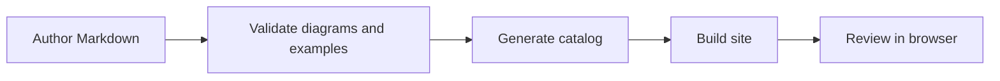

# Write documentation

LeapView documentation is maintained like product code: authored Markdown stays close to the implementation, executable examples are validated, generated reference is derived from source contracts, and structural changes are reviewed in the public site. Choose an article type before writing so readers know whether they are learning, completing a task, understanding a design, or looking up exact syntax.

## Choose the article type

- **Tutorials** teach an end-to-end workflow and prioritize a successful first experience.
- **How-to guides** complete one concrete task for a reader who already understands the surrounding concepts.
- **Concept articles** explain why the system behaves as it does and connect related resources or boundaries.
- **Reference pages** describe exact accepted contracts. Generate these from code whenever possible.

Do not combine all four modes in one long page. Link from a procedure to the relevant concept and generated reference instead of repeating either one.

## Use the procedural article template

Start each how-to guide with this structure and remove only sections that genuinely do not apply:

````markdown
# Accomplish a concrete outcome

Explain what the reader will achieve and when to use this procedure.

## Before you begin

- Required project state
- Required permissions
- Required tools or data

## Create the resource

1. Make the smallest meaningful change.
2. Explain why each non-obvious field is required.
3. Keep the complete configuration close to the step that introduces it.

```yaml
# A schema-valid LeapView resource or focused fragment.
```

## Validate the configuration

Show the exact validation command and describe successful output.

## Verify the result

Describe an observable UI, CLI, API, or persisted-state result.

## Troubleshooting

Map likely symptoms to causes and corrective actions.

## Next steps

Link to two or three directly related guides, concepts, or reference pages.
````

Every procedure needs a stated outcome, explicit prerequisites, numbered actions, validation, and an observable success condition. Prefer several small verified stages to one large configuration dump.

## Add diagrams only when they clarify structure

Use Mermaid for sequences, resource relationships, state transitions, and flows with meaningful branches. Use prose for a single fact, a table for repeated field comparisons, and code for exact configuration. A diagram should normally contain no more than about seven primary nodes; split a dense system map into focused views.

Author a diagram as a fenced block:



Include `accTitle` and `accDescr` in every diagram. The site renders a responsive SVG with the current Primer-derived light or dark theme. Do not add fixed colors in Mermaid source; shared tokens keep diagrams legible across themes.

## Validate and review

Run:

```sh
task docs:check
bun run test:site
```

`docs:check` parses every Mermaid fence, validates YAML examples, checks links and navigation ownership, and detects generated catalog drift. Browser tests cover responsive SVG rendering and theme changes. Before review, inspect the page at desktop, tablet, and compact widths and confirm the diagram adds information that the surrounding prose does not already communicate.
