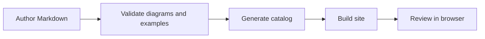

# Write documentation

LeapView documentation is maintained like product code: authored Markdown stays close to the implementation, executable examples are validated, generated reference is derived from source contracts, and structural changes are reviewed in the public site. Choose an article type before writing so readers know whether they are learning, completing a task, understanding a design, or looking up exact syntax.

## Choose the article type

- **Tutorials** teach an end-to-end workflow and prioritize a successful first experience.
- **How-to guides** complete one concrete task for a reader who already understands the surrounding concepts.
- **Concept articles** explain why the system behaves as it does and connect related resources or boundaries.
- **Reference pages** describe exact accepted contracts. Generate these from code whenever possible.
- **Landing pages** orient readers and route them to focused pages. They are navigation aids rather than a fifth Diátaxis content type.

Do not combine all four modes in one long page. Link from a procedure to the relevant concept and generated reference instead of repeating either one.

Declare the page's purpose in `docs/navigation.yaml`:

```yaml
- slug: guides/build/connect-data
  title: Connect a data source
  type: how-to
  summary: Add a connection and source definitions to a project.
  source: articles/build/connect-data.md
```

Supported types are `landing`, `tutorial`, `how-to`, `explanation`, and `reference`. Generated collection pages are always `reference`. The public navigation remains organized around user journeys and product areas; the type controls how an individual page is authored and validated.

A landing page briefly orients the reader and links to at least two focused documentation destinations. Keep commands, configuration, and exhaustive background out of landing pages: move procedures into how-to guides, background into concepts, and accepted syntax into reference. `docs:check` rejects fenced code on a landing page so it cannot gradually become an unclassified procedure.

## Use the tutorial template

A tutorial is a guided learning experience, not merely a long procedure. Keep the learner on one safe, reproducible path and take responsibility for a successful outcome. Every tutorial includes:

- `Before you begin` with a known starting state;
- small stages that introduce only what the learner needs at that moment;
- a `Verify...` section with an observable result;
- `Troubleshooting` for likely blockers; and
- `Next steps` that hand the reader to task-oriented guides, concepts, or reference.

Avoid optional branches and exhaustive configuration discussion inside a tutorial. Link to a how-to guide when a competent reader needs to adapt the workflow to a real situation.

## Use the procedural article template

Start each how-to guide with this structure and remove only sections that genuinely do not apply:

````markdown
# Accomplish a concrete outcome

Explain what the reader will achieve and when to use this procedure.

## Before you begin

- Required project state
- Required permissions
- Required tools or data

## Create the resource

1. Make the smallest meaningful change.
2. Explain why each non-obvious field is required.
3. Keep the complete configuration close to the step that introduces it.

```yaml
# A schema-valid LeapView resource or focused fragment.
```

## Validate the configuration

Show the exact validation command and describe successful output.

## Verify the result

Describe an observable UI, CLI, API, or persisted-state result.

## Troubleshooting

Map likely symptoms to causes and corrective actions.

## Next steps

Link to two or three directly related guides, concepts, or reference pages.
````

Every procedure needs a stated outcome, explicit prerequisites, numbered actions, validation, and an observable success condition. Prefer several small verified stages to one large configuration dump. Keep commands and configuration representative of the workflow, then link to generated reference for the complete accepted flags, fields, operations, and schemas.

## Add diagrams only when they clarify structure

Use Mermaid for sequences, resource relationships, state transitions, and flows with meaningful branches. Use prose for a single fact, a table for repeated field comparisons, and code for exact configuration. A diagram should normally contain no more than about seven primary nodes; split a dense system map into focused views.

Author a diagram as a fenced block:



Include `accTitle` and `accDescr` in every diagram. The site renders a responsive SVG with the current Primer-derived light or dark theme. Do not add fixed colors in Mermaid source; shared tokens keep diagrams legible across themes.

## Validate and review

Run:

```sh
task docs:check
bun run test:site
```

`docs:check` requires every page to declare a supported documentation type. It enforces the tutorial sections above, keeps landing pages free of fenced code and connected to at least two documentation destinations, requires every how-to guide to expose a validation, verification, testing, or troubleshooting boundary, and requires authored reference pages to contain scannable lists, tables, or code contracts. It also parses every Mermaid fence, validates YAML examples, checks links and navigation ownership, crawls every rendered internal documentation link through redirects, validates fragment anchors, and detects generated catalog drift. External URLs are intentionally excluded from this deterministic check. Browser tests cover responsive SVG rendering and theme changes. Before review, inspect the page at desktop, tablet, and compact widths and confirm the diagram adds information that the surrounding prose does not already communicate.

The agent tool pages under `docs/reference/agent-tools/` are generated from the canonical runtime provider composition. Change the owning tool definition or schema, then run `task agent-tool-docs:generate`; do not edit those Markdown or JSON artifacts directly. `task docs:check` regenerates the reference in a temporary directory and rejects any drift.
