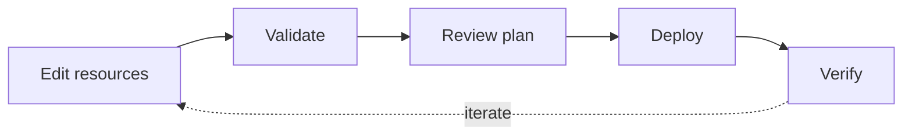

# Build your first dashboard

The included Sales workspace is a complete example of the dashboard-as-code workflow. Make and validate a small change there before creating connections, model tables, and semantic models from scratch.

## Before you begin

Complete [Installation](/docs/installation), bootstrap the Olist data, and keep the development target local. Use a branch where changing the example label and note is safe.

Follow one reviewable loop:

1. Confirm the unchanged sample dashboard works.
2. Trace the resources that compose it.
3. Change one semantic label and one dashboard note.
4. Validate and plan the complete project.
5. Deploy to development and verify the rendered behavior.



## Start the sample project

Prepare the Olist sample data and start the managed development server:

```sh
task bootstrap
task dev
```

The server writes worktree-local process state and logs beneath `.tmp/`. Open the URL printed by `task dev`, select **Sales Workspace**, and open **Executive Sales**. Confirm that the KPI cards, revenue trend, category chart, filters, and orders table load before editing files.

## Trace the resources

The report is assembled from these files:

```text
dashboards/leapview.yaml
dashboards/connections/olist.yaml
dashboards/sources/olist.*.yaml
dashboards/workspaces/sales/workspace.yaml
dashboards/workspaces/sales/models/*.yaml
dashboards/workspaces/sales/semantic-models/sales.yaml
dashboards/workspaces/sales/dashboards/executive-sales.yaml
```

Read them from the outside in. The project discovers the Sales workspace. The workspace permits specific Olist sources and discovers its models, semantic model, dashboard, and access rules. The dashboard finally refers to fields and measures exposed by the `sales` semantic model.

## Add a semantic metric

Open `dashboards/workspaces/sales/semantic-models/sales.yaml`. Its `revenue` and `order_count` measures are the inputs to the existing average-order-value metric:

```yaml
metrics:
  aov:
    label: Average order value
    expression: safe_divide(${revenue}, ${order_count})
    format: currency
```

For a first change, update only the label to `Average revenue per order`. This changes presentation metadata without changing the metric identity or formula. Stable IDs such as `aov` let dashboards and API clients continue referring to the same semantic field.

Validate the entire project, not just the edited file:

```sh
go run ./cmd/leapview validate --project dashboards/leapview.yaml
```

If validation reports a location, fix the resource before continuing. Common first-edit failures are incorrect indentation, an unknown field, or a reference to a semantic name that does not exist.

## Change the dashboard

Open `dashboards/workspaces/sales/dashboards/executive-sales.yaml`. Find the `aov_kpi` visual and change its note:

```yaml
aov_kpi:
  type: kpi
  shape: single_value
  query:
    measures:
      aov:
  options:
    note: Average revenue per completed order
    tone: amber
```

The visual owns its semantic query and presentation options. A page component later places that reusable visual on the grid by referencing `aov_kpi`.

## Review and deploy the change

Inspect the candidate before activating it:

```sh
go run ./cmd/leapview plan --project dashboards/leapview.yaml
```

Apply it to the managed development target:

```sh
task deploy:dev
```

## Validate the project

Run validation and planning once more immediately before deployment if another edit occurred after the earlier checks:

```sh
go run ./cmd/leapview validate --project dashboards/leapview.yaml
go run ./cmd/leapview plan --project dashboards/leapview.yaml
```

The plan should contain only the resources you intended to change. Unexpected additions or removals usually indicate a discovery-pattern or stable-ID mistake.

## Verify the dashboard

Reload Executive Sales and confirm both label changes. Also change a date or state filter to verify that the KPI still participates in the shared query lifecycle.

LeapView validates all workspace candidates before switching the active project. A rejected candidate does not replace the last valid serving state. This makes validation and plan review normal parts of authoring rather than recovery steps.

## Troubleshooting

If the dashboard does not change, confirm the deployment targeted the same local instance shown in the browser and inspect `task dev:logs`. If validation cannot find `aov`, verify that the metric ID was not renamed. If the KPI changes but filtering does not, compare its semantic query and interaction scope with the original definition before editing presentation code.

## Next steps

Revert or keep the example changes as appropriate for your branch, then continue with [Build dashboards](/docs/guides/build) for the complete workflow.
