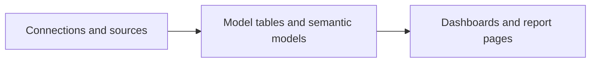

# What is LeapView?

LeapView is a lightweight, code-native business intelligence workspace. Data teams define data access, analytical models, business metrics, dashboards, and access rules as versioned resources, then deliver those resources as one reviewed project.

The intended experience is familiar to teams that use tools such as Power BI: people can discover workspaces, open report pages, filter results, inspect charts, and work with analytical tables. The difference is where the source of truth lives. In LeapView, reusable business logic and dashboard composition remain in YAML and can move through the same review, testing, and deployment process as application code.

## When LeapView is a good fit

LeapView is designed for a team that wants:

- dashboards and semantic models reviewed through Git;
- a small, self-hosted BI application instead of a collection of separate services;
- DuckDB execution over managed or locally accessible analytical data;
- repeatable environments without duplicating dashboard definitions;
- both an interactive browser workspace and headless CLI/API access;
- explicit ownership and access boundaries around each workspace.

It is not intended to make every browser edit authoritative. The browser is a consumption and interaction surface; durable definitions belong in project resources.

## The resource layers

A LeapView project has three main layers:

1. Connections and sources identify physical inputs and give them stable project-level names.
2. Model tables and semantic models turn those inputs into reusable analytical concepts.
3. Dashboards compose semantic queries into filters, KPIs, charts, tables, and report pages.

Workspace access resources apply alongside those layers. The global agent and MCP execute the same governed tools against an explicitly selected asset workspace. Separate dev, staging, and production instances can run the same validated project source without requiring a second copy of the YAML tree.

## How a request is served

Go loads and validates the active resources, resolves authorization and semantic fields, and sends bounded work to DuckDB. The initial page is rendered with gomponents. Datastar streams server-owned state to the browser, where focused Lit components render filters, charts, tables, navigation, and other interactive surfaces.

This division keeps credentials, unrestricted SQL, authorization, and query truth on the server. Browser components receive presentation-shaped payloads and emit small commands when a user changes a filter or selects data.

## What lives in the repository

A typical project contains one project manifest, project-global connections and sources, and one or more workspaces. Each workspace owns its model tables, semantic models, dashboards, role bindings, data policies, and refresh pipelines. Generated JSON Schemas describe the exact shape of every resource.

Start with [Get started with LeapView](/docs/getting-started) to run the included project. Then read [Projects, workspaces, and environments](/docs/concepts/projects-workspaces-environments) before creating a project of your own.
